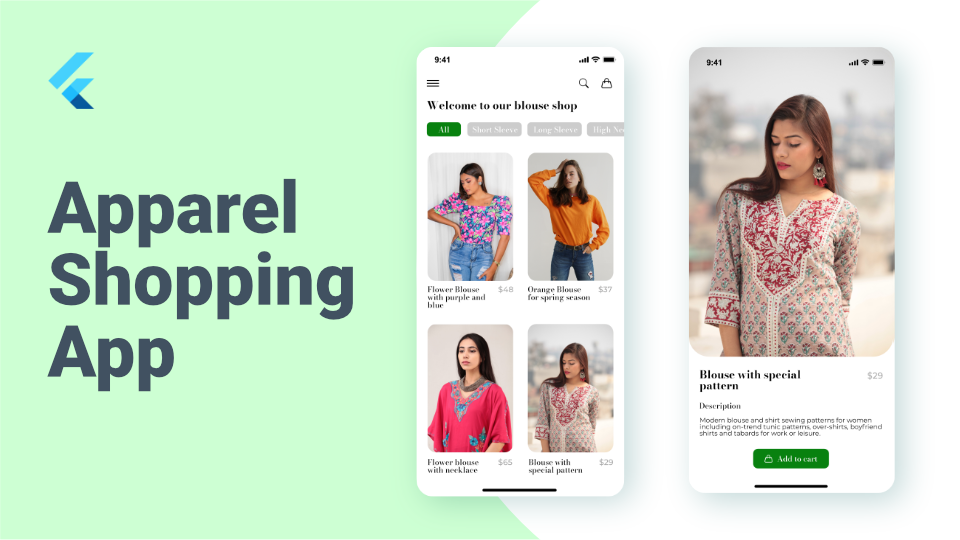

# blouse_shop

A Blouse Clothing App developed in Flutter, you can follow along in the youtube video as a tutorial or guide. You can also use this repo for your personal project to get ideas or implement features.

## [Watch it on YouTube](https://www.youtube.com/watch?v=t7i0ZGCVi8Y)

## Getting Started

A few resources to get you started if this is your first Flutter project:

- [Lab: Write your first Flutter app](https://flutter.dev/docs/get-started/codelab)
- [Cookbook: Useful Flutter samples](https://flutter.dev/docs/cookbook)
